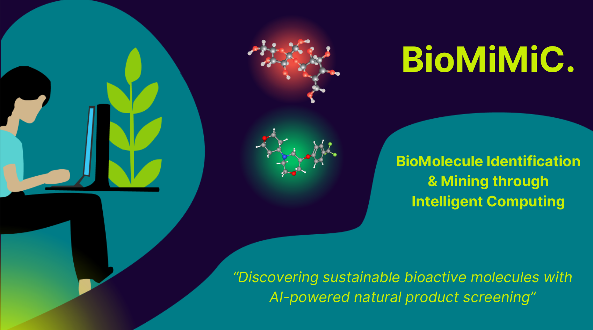

# BioMiMiC



2nd Winner of the [D4GEN 2024](https://genopole.agorize.com/fr/challenges/d4gen-hackathon-2024) hackathon organized by the [genopole](https://www.google.com/search?channel=fs&client=ubuntu&q=genopole) in partnership with [Onepoint](https://www.groupeonepoint.com/fr/) and [AWS](https://aws.amazon.com/fr/).

This project has been conduct within 48h by [Maryam Cherradi](https://github.com/DSMaryam), [Valentin Laforgue](https://github.com/ryvalemusicc) and [Auguste Gardette](https://github.com/Aaramis).

## I. Introduction

The discovery of new bioactive molecules is a major challenge in many fields, including health, agronomy and the environment. However, conventional approaches to screening synthetic molecules are costly, time-consuming and environmentally unfriendly.

An alternative is to exploit natural biodiversity as a source of molecules. Indeed, living organisms produce a myriad of compounds with properties acquired over the course of evolution. Unfortunately, only a tiny fraction of this molecular diversity has been characterized to date, and many uncharacterized molecules are available in the COCONUT database.

It is in this context that machine learning approaches open up new perspectives. By combining molecular data available on online databases such as Pubchem and ChEMBL with artificial intelligence methods, it becomes possible to predict the biological activities of as yet unexplored natural molecules and effectively guide their discovery.

Our challenge is therefore to develop tools capable of making the most of existing data resources, in order to accelerate the discovery of natural molecules of interest while preserving biodiversity.


## II. Getting Start

To start working on this project, follow these steps:

### SMILES-BERT

* Clone the repository: ```git clone git@github.com:Aaramis/BioMiMiC.git```
* Create a virtual environment: ```conda env create --file environment.yml```
* Activate the virtual environment: ``` conda activate hugging_face ```


### Update environment

* Using conda: ```conda env export > environment.yml```

### To do

Please checkout [config file](./SMILES-BERT/config_bert.py) before running codes.
According to your need you will have to adapt your dataset, you can find more details in the [notebook](./pretrait.ipynb) 

### [Finetune File :](./SMILES-BERT/finetuning.py)

Code to finetune SMILE-BERT to a specific task.

```python
python finetuning.py
```

### [Predict File :](./SMILES-BERT/predict.py)

Code to screen COCONUT database

```python
python predict.py --COCONUT
```

| Argument          | Description                      |
|-------------------|----------------------------------|
| --COCONUT         | Flag to trigger COCONUT          |
| --prediction_path | Path for prediction output       |


### Website

We starting using django at the beggining but to speed-up the process, we decided to move to streamlit.

To see the website MVP mock-up, please run the following command-line :

```bash
cd test_streamlit
streamlit run landing.py
```